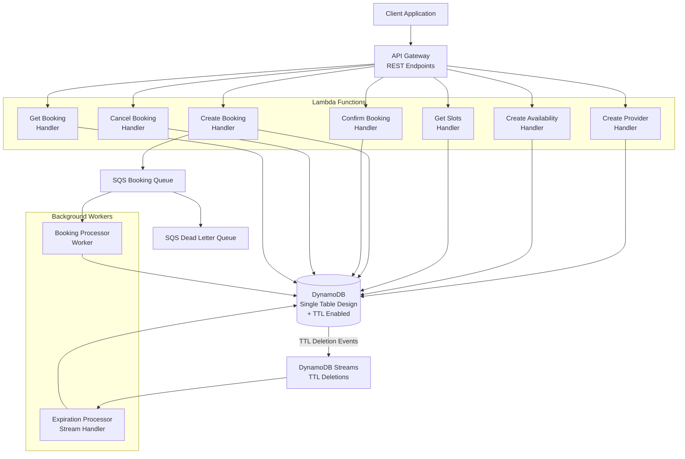
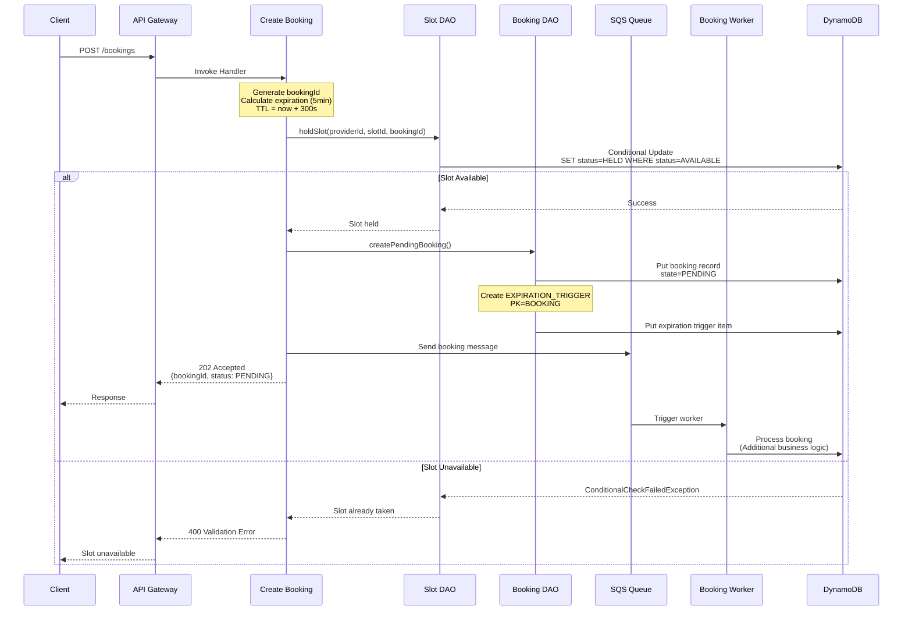
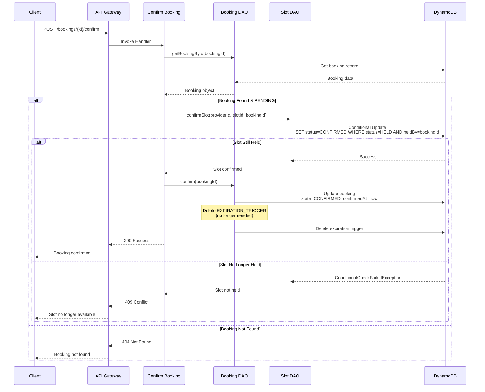
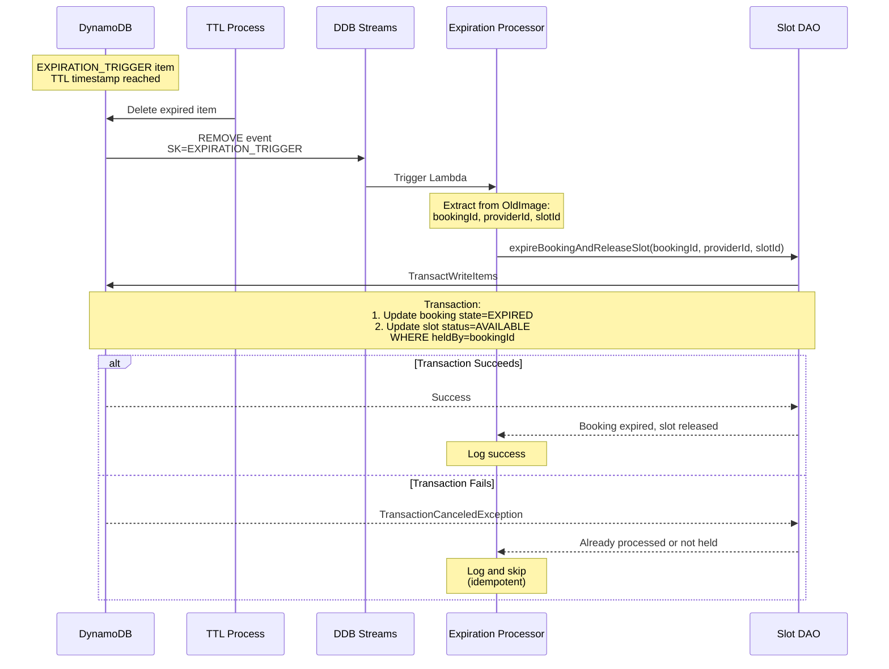
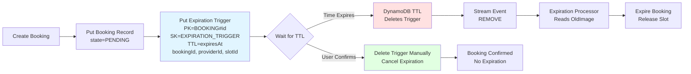
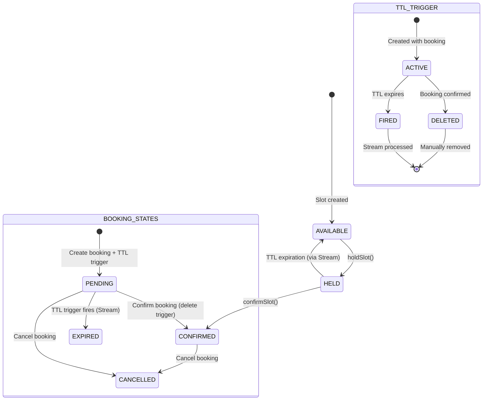
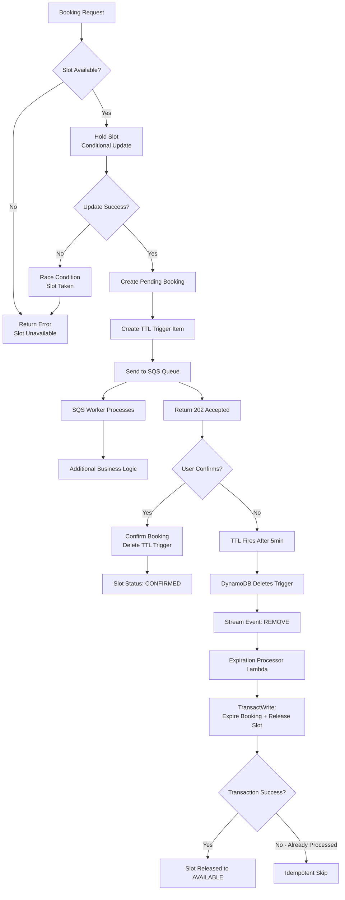

# Appointment Booking System - Flow Diagram

## System Architecture Overview



## Detailed Booking Flow



## Booking Confirmation Flow



## TTL Expiration Flow (DynamoDB Streams)



## Expiration Trigger Pattern



## Data Model & Key Structure

```mermaid
erDiagram
    SINGLE_TABLE {
        string PK "Partition Key"
        string SK "Sort Key"
        string GSI1PK "User bookings index"
        string GSI1SK "Booking timestamp"
        string GSI2PK "Provider bookings index"
        string GSI2SK "Booking timestamp"
        string GSI3PK "Status-based queries"
        string GSI3SK "Expiration timestamp"
        number TTL "Time-to-live attribute"
    }
    
    PROVIDER {
        string PK "PROVIDER#providerId"
        string SK "METADATA"
        string providerName
        string providerType
        string createdAt
    }
    
    AVAILABILITY {
        string PK "PROVIDER#providerId"
        string SK "AVAILABILITY#date"
        string startTime
        string endTime
        number slotDurationMinutes
        string createdAt
    }
    
    SLOT {
        string PK "PROVIDER#providerId"
        string SK "SLOT#date#time"
        string status "AVAILABLE|HELD|CONFIRMED"
        string heldBy "bookingId (optional)"
        string holdExpiresAt "ISO timestamp (optional)"
        string confirmedAt "timestamp (optional)"
    }
    
    BOOKING {
        string PK "BOOKING#bookingId"
        string SK "METADATA"
        string providerId
        string slotId "date#time"
        string userId
        string state "PENDING|CONFIRMED|EXPIRED|CANCELLED"
        string createdAt
        string expiresAt
        string confirmedAt "optional"
        string cancelledAt "optional"
        string GSI1PK "USER#userId"
        string GSI1SK "BOOKING#timestamp"
        string GSI2PK "PROVIDER#providerId"
        string GSI2SK "BOOKING#timestamp"
        string GSI3PK "STATUS#state"
        string GSI3SK "EXPIRES#expiresAt"
    }
    
    EXPIRATION_TRIGGER {
        string PK "BOOKING#bookingId"
        string SK "EXPIRATION_TRIGGER"
        string bookingId "For stream processing"
        string providerId "For stream processing"
        string slotId "For stream processing"
        number TTL "Unix timestamp (expiresAt)"
    }
```

## State Transitions



## Concurrency & Error Handling



## API Endpoints Summary

| Method | Endpoint | Handler | Purpose |
|--------|----------|---------|---------|
| POST | `/providers` | CreateProvider | Create service provider |
| POST | `/providers/{id}/availability` | CreateAvailability | Set provider availability |
| GET | `/providers/{id}/slots?date=YYYY-MM-DD` | GetSlots | Get available time slots |
| POST | `/bookings` | CreateBooking | Create new booking (PENDING) + TTL trigger |
| POST | `/bookings/{id}/confirm` | ConfirmBooking | Confirm pending booking + delete trigger |
| POST | `/bookings/{id}/cancel` | CancelBooking | Cancel booking |
| GET | `/bookings/{id}` | GetBooking | Get booking details |

## Key Design Patterns

### 1. Two-Phase Booking
- **Phase 1**: Hold slot (5min expiration) + Create PENDING booking + Create TTL trigger
- **Phase 2**: User confirms → CONFIRMED state + Delete TTL trigger

### 2. TTL + Streams Pattern
- **TTL Trigger Item**: Separate item with TTL attribute for automatic deletion
- **DynamoDB Streams**: Captures TTL deletion events
- **Stream Processor**: Reacts to deletions and performs cleanup logic
- **Idempotent Processing**: TransactWrite ensures no double-processing

### 3. Optimistic Concurrency Control
- DynamoDB conditional updates prevent race conditions
- TransactWrite for atomic booking expiration + slot release
- No distributed locks needed
- High performance under contention

### 4. Event-Driven Architecture
- SQS for async booking processing
- DynamoDB Streams for expiration handling
- Decoupled components with retry logic

### 5. Single Table Design
- All entities in one DynamoDB table
- GSIs for different access patterns
- Separate expiration trigger items for clean separation of concerns
- Cost-efficient and supports atomic transactions

## Why This Approach?

### Advantages of TTL + Streams:
1. **No polling**: DynamoDB handles deletion automatically
2. **Precise timing**: TTL is more accurate than periodic schedulers
3. **Cost-effective**: No EventBridge rules or continuous Lambda execution
4. **Scalable**: Streams process events in parallel
5. **Reliable**: Built-in retry with DLQ support
6. **Idempotent**: Transaction ensures slot released only once

### Implementation Details:
- **Expiration Trigger**: Stores metadata needed for cleanup (bookingId, providerId, slotId)
- **Stream Filter**: Only processes `REMOVE` events where `SK=EXPIRATION_TRIGGER`
- **Atomic Cleanup**: TransactWrite updates booking state AND releases slot
- **Graceful Handling**: If booking already confirmed/cancelled, transaction condition fails safely

This architecture provides automatic expiration handling without the complexity of scheduled jobs while maintaining strong consistency guarantees.
