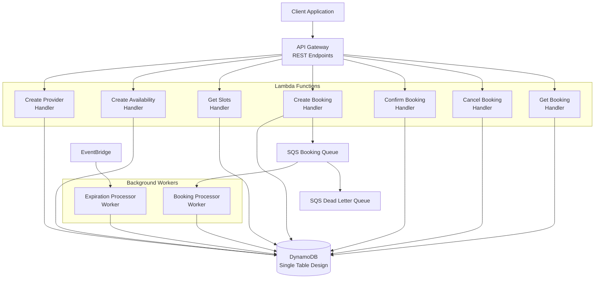
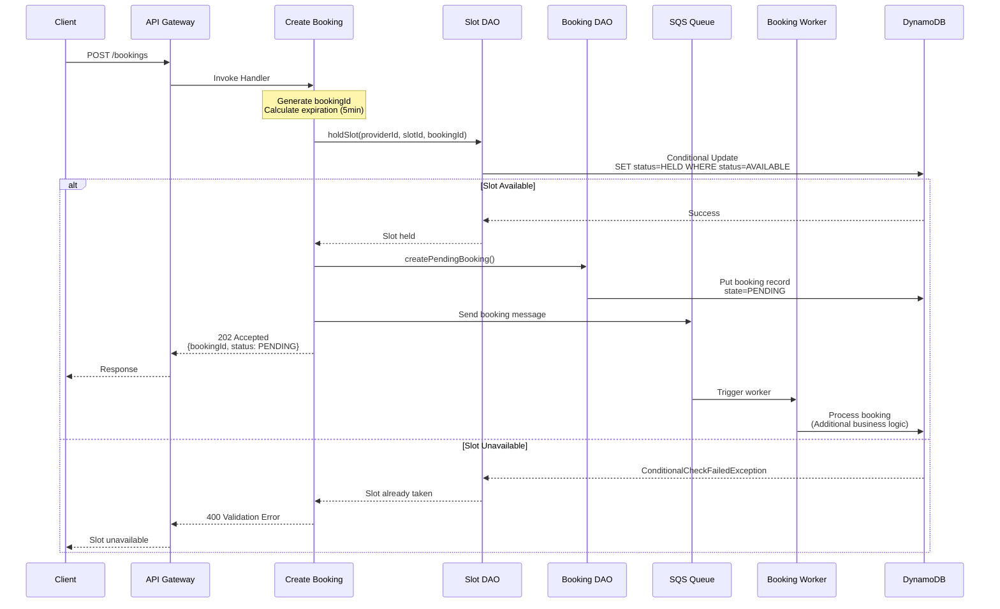
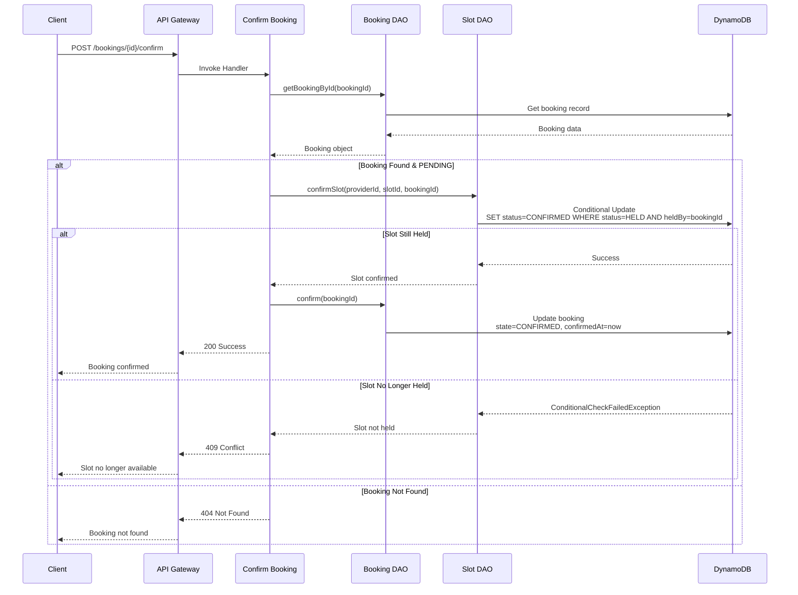
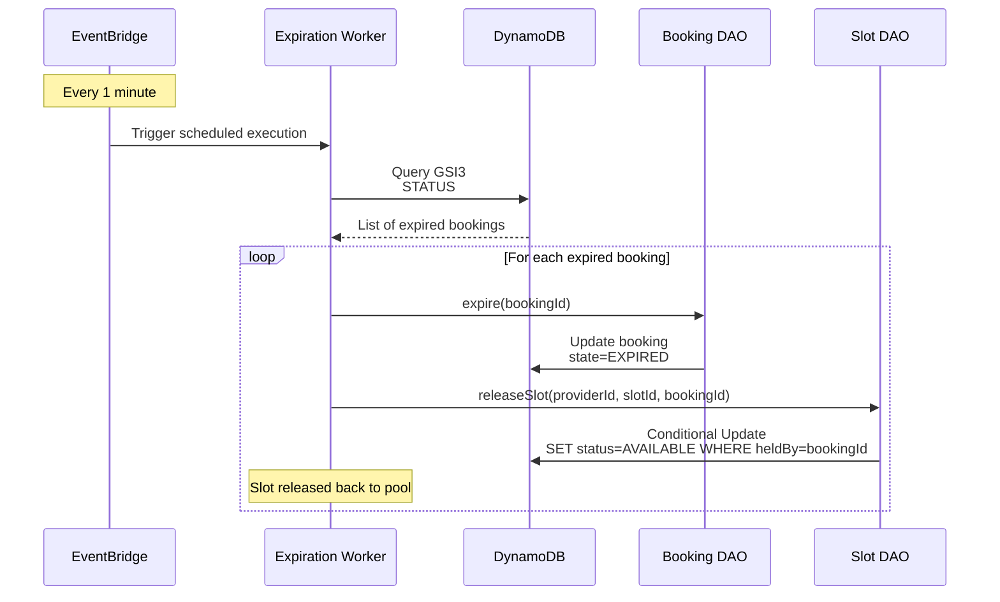
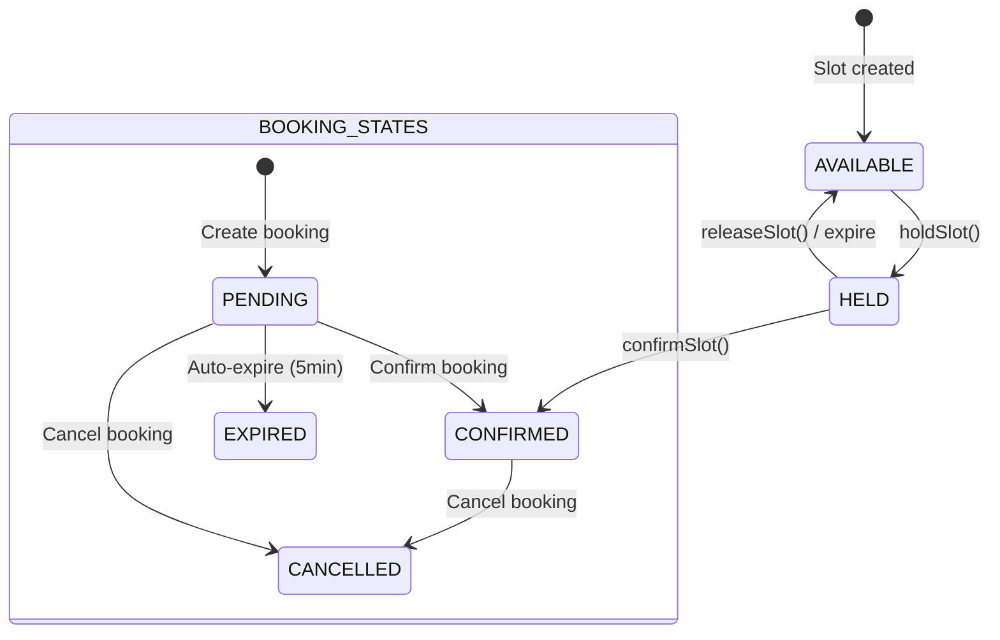
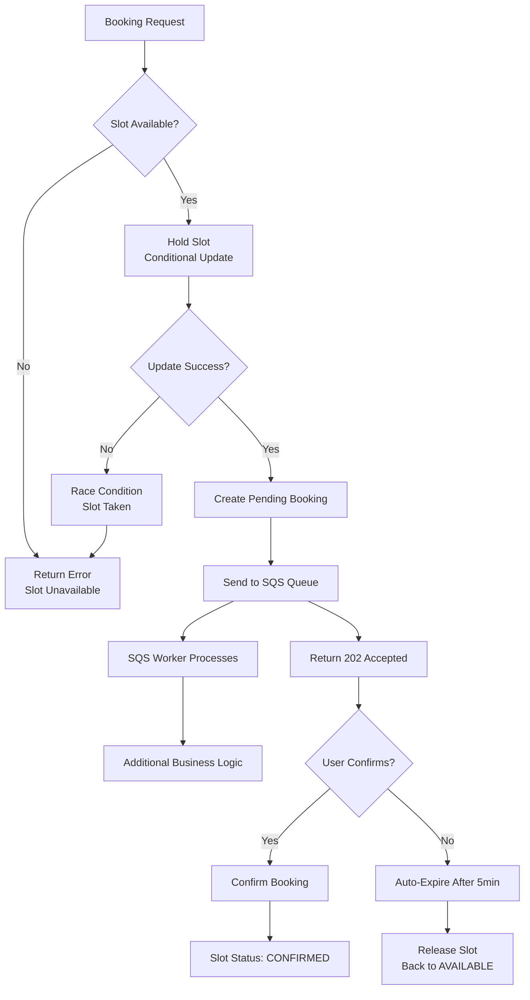

# Appointment Booking System - Flow Diagram

## System Architecture Overview



## Detailed Booking Flow



## Booking Confirmation Flow



## Expiration Worker Flow



## Data Model & Key Structure

```mermaid
erDiagram
    SINGLE_TABLE {
        string PK "Partition Key"
        string SK "Sort Key"
        string GSI1PK "User bookings index"
        string GSI1SK "Booking timestamp"
        string GSI2PK "Provider bookings index"
        string GSI2SK "Booking timestamp"
        string GSI3PK "Status-based queries"
        string GSI3SK "Expiration timestamp"
    }
    
    PROVIDER {
        string PK "PROVIDER#providerId"
        string SK "METADATA"
        string providerName
        string providerType
        string createdAt
    }
    
    AVAILABILITY {
        string PK "PROVIDER#providerId"
        string SK "AVAILABILITY#date"
        string startTime
        string endTime
        number slotDurationMinutes
        string createdAt
    }
    
    SLOT {
        string PK "PROVIDER#providerId"
        string SK "SLOT#date#time"
        string status "AVAILABLE|HELD|CONFIRMED"
        string heldBy "bookingId (optional)"
        string holdExpiresAt "TTL (optional)"
        string confirmedAt "timestamp (optional)"
    }
    
    BOOKING {
        string PK "BOOKING#bookingId"
        string SK "METADATA"
        string providerId
        string slotId "date#time"
        string userId
        string state "PENDING|CONFIRMED|EXPIRED|CANCELLED"
        string createdAt
        string expiresAt
        string confirmedAt "optional"
        string cancelledAt "optional"
        string GSI1PK "USER#userId"
        string GSI1SK "BOOKING#timestamp"
        string GSI2PK "PROVIDER#providerId"
        string GSI2SK "BOOKING#timestamp"
        string GSI3PK "STATUS#state"
        string GSI3SK "EXPIRES#expiresAt"
    }
```

## State Transitions



## Concurrency & Error Handling



## API Endpoints Summary

| Method | Endpoint | Handler | Purpose |
|--------|----------|---------|---------|
| POST | `/providers` | CreateProvider | Create service provider |
| POST | `/providers/{id}/availability` | CreateAvailability | Set provider availability |
| GET | `/providers/{id}/slots?date=YYYY-MM-DD` | GetSlots | Get available time slots |
| POST | `/bookings` | CreateBooking | Create new booking (PENDING) |
| POST | `/bookings/{id}/confirm` | ConfirmBooking | Confirm pending booking |
| POST | `/bookings/{id}/cancel` | CancelBooking | Cancel booking |
| GET | `/bookings/{id}` | GetBooking | Get booking details |

## Key Design Patterns

### 1. Two-Phase Booking
- **Phase 1**: Hold slot (5min expiration) + Create PENDING booking
- **Phase 2**: User confirms → CONFIRMED state

### 2. Optimistic Concurrency Control
- DynamoDB conditional updates prevent race conditions
- No distributed locks needed
- High performance under contention

### 3. Event-Driven Architecture
- SQS for async processing
- EventBridge for scheduled cleanup
- Decoupled components

### 4. Single Table Design
- All entities in one DynamoDB table
- GSIs for different access patterns
- Cost-efficient and atomic transactions

This flow diagram shows the complete system architecture, data flow, state transitions, and key design patterns used in the appointment booking system.