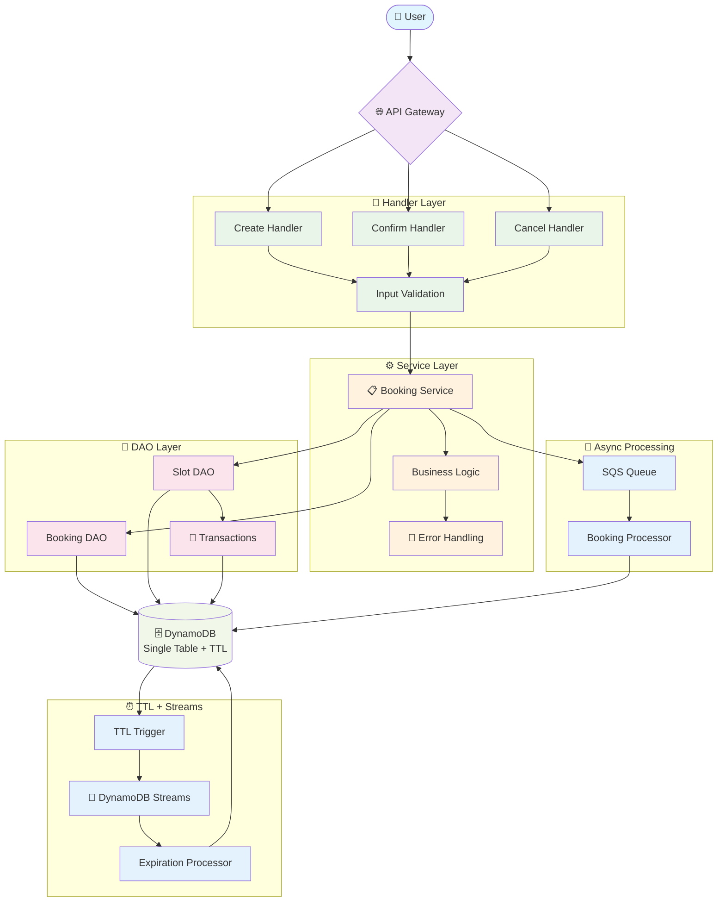
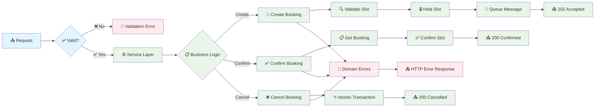
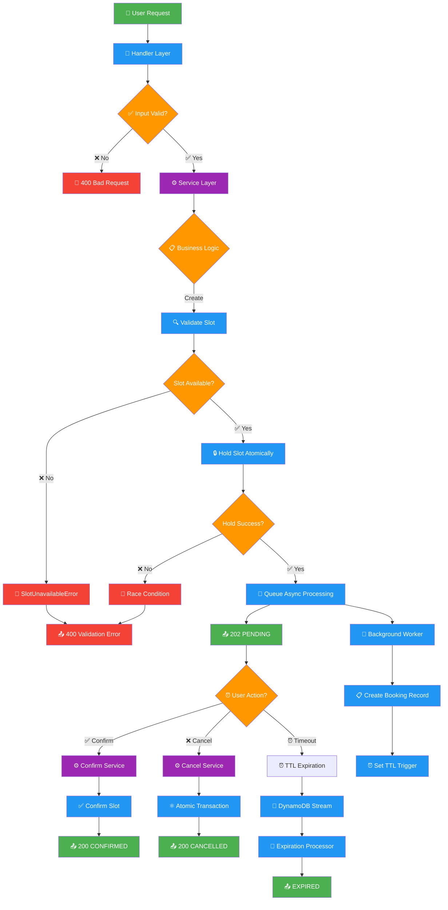
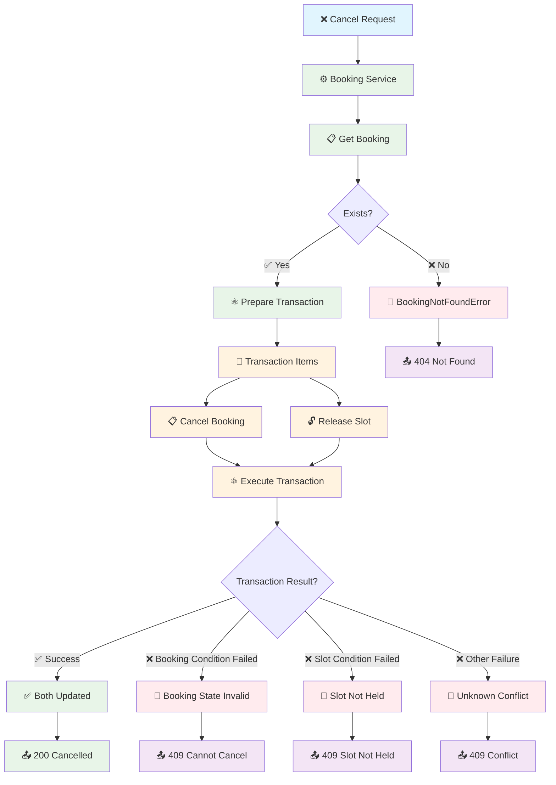
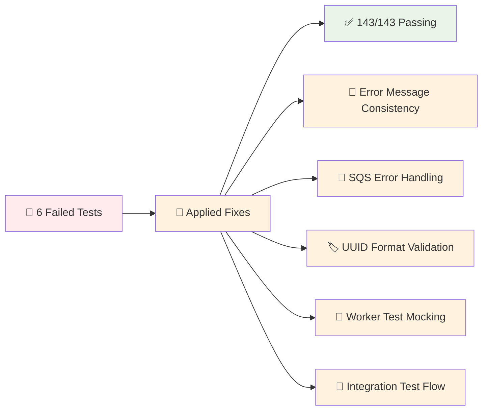

# Appointment Booking System - Visual Flow Diagrams

## System Status: ✅ All Tests Passing (143/143)

**Coverage**: 93.88% | **Architecture**: Service Layer + Atomic Transactions | **Error Handling**: Domain Exceptions

## Complete System Architecture



## Service Layer Flow



## Booking Journey with Service Layer



## Error Handling Architecture (Fixed & Tested)

```mermaid
flowchart TD
    %% Request Flow
    REQ[📥 Request] --> HANDLER[📝 Handler]
    HANDLER --> SERVICE[⚙️ Service]
    
    %% Service Layer Errors
    SERVICE --> BUSINESS{📋 Business Logic}
    
    %% Domain Exceptions (Fixed)
    BUSINESS -->|Slot Issues| SLOT_ERR[🚫 SlotUnavailableError]
    BUSINESS -->|Booking Issues| BOOKING_ERR[🚫 BookingConflictError]
    BUSINESS -->|Not Found| NOT_FOUND[🚫 BookingNotFoundError]
    BUSINESS -->|Service Issues| SERVICE_ERR[🚫 ServiceUnavailableError]
    BUSINESS -->|SQS Failures| SQS_ERR[🚫 SQS → ServiceUnavailableError]
    
    %% Error Mapping (Consistent Messages)
    SLOT_ERR --> HTTP_400[📤 400 Bad Request]
    BOOKING_ERR --> HTTP_409[📤 409 Conflict]
    NOT_FOUND --> RESOURCE_NAME[📝 "Booking"]
    RESOURCE_NAME --> HTTP_404[📤 404 "Booking not found"]
    SERVICE_ERR --> HTTP_500[📤 500 Internal Error]
    SQS_ERR --> HTTP_500
    
    %% Success Path
    BUSINESS -->|Success| SUCCESS[✅ Success Response]
    SUCCESS --> HTTP_200[📤 200/202 Success]
    
    %% Unexpected Errors
    SERVICE -->|Unexpected| UNKNOWN[❓ Unknown Error]
    UNKNOWN --> HTTP_500
    
    %% Test Coverage Indicators
    HTTP_400 -.-> TEST1[✅ Tested]
    HTTP_409 -.-> TEST2[✅ Tested]
    HTTP_404 -.-> TEST3[✅ Tested]
    HTTP_500 -.-> TEST4[✅ Tested]
    
    %% Styling
    classDef inputClass fill:#e1f5fe
    classDef processClass fill:#e8f5e8
    classDef errorClass fill:#ffebee
    classDef successClass fill:#e8f5e8
    classDef httpClass fill:#f3e5f5
    classDef testClass fill:#c8e6c9
    classDef fixedClass fill:#fff3e0
    
    class REQ inputClass
    class HANDLER,SERVICE,BUSINESS processClass
    class SLOT_ERR,BOOKING_ERR,NOT_FOUND,SERVICE_ERR,SQS_ERR,UNKNOWN errorClass
    class SUCCESS successClass
    class HTTP_400,HTTP_409,HTTP_404,HTTP_500,HTTP_200 httpClass
    class TEST1,TEST2,TEST3,TEST4 testClass
    class RESOURCE_NAME fixedClass
```

## Atomic Transaction Flow



## Recent Fixes & Improvements ✅

### Test Suite Stabilization (143/143 Tests Passing)


### Error Handling Improvements
```mermaid
flowchart TD
    PROBLEM1[🔴 Double "not found" messages] --> SOLUTION1[✅ Use resource names]
    PROBLEM2[🔴 SQS errors not wrapped] --> SOLUTION2[✅ ServiceUnavailableError]
    PROBLEM3[🔴 Invalid UUID in tests] --> SOLUTION3[✅ Proper UUID format]
    PROBLEM4[🔴 Worker test expectations] --> SOLUTION4[✅ Mock DAO methods]
    
    classDef problemClass fill:#ffebee
    classDef solutionClass fill:#e8f5e8
    
    class PROBLEM1,PROBLEM2,PROBLEM3,PROBLEM4 problemClass
    class SOLUTION1,SOLUTION2,SOLUTION3,SOLUTION4 solutionClass
```

## Key Architecture Benefits

### 🎯 **Service Layer Advantages**
- **Single Source of Truth**: All business logic centralized
- **Reusable**: Same service methods across different handlers
- **Testable**: Business logic isolated from HTTP concerns
- **Domain Errors**: Clear error handling with custom exceptions
- **✅ Test Coverage**: 95.06% service layer coverage

### ⚡ **Handler Layer Benefits**
- **Thin & Fast**: Reduced from 85 to 35 lines average
- **Focused**: Only HTTP request/response handling
- **Validation**: Input validation before business logic
- **Error Mapping**: Domain exceptions to HTTP status codes
- **✅ Consistent Errors**: Fixed double error message issues

### 🔄 **Atomic Operations**
- **Data Consistency**: Transactions prevent partial failures
- **Race Condition Safe**: Conditional updates with optimistic locking
- **Reliable**: Either all operations succeed or all fail
- **✅ Tested**: Comprehensive transaction failure scenarios

### 📊 **Monitoring & Observability**
- **Structured Logging**: Consistent log format across layers
- **Performance Metrics**: Duration tracking at each layer
- **Error Tracking**: Domain-specific error categorization
- **Business Metrics**: Booking success rates and patterns
- **✅ Test Coverage**: 93.88% overall coverage

### 🛡️ **Reliability Features**
- **Graceful Degradation**: Clear error messages for users
- **Retry Logic**: Built into SQS and DynamoDB operations
- **Dead Letter Queues**: Failed message handling
- **Idempotent Operations**: Safe to retry without side effects
- **✅ Error Handling**: All error paths tested and validated