# Appointment Booking System - Visual Flow Diagram

## Complete System Flow

```mermaid
flowchart TD
    %% User Actions
    User([👤 User]) 
    
    %% API Layer
    API{🌐 API Gateway}
    
    %% Core Flows
    subgraph "📋 Provider Setup"
        CP[Create Provider]
        CA[Create Availability] 
        GS[Generate Slots]
    end
    
    subgraph "🎯 Booking Process"
        CB[Create Booking]
        HS[Hold Slot]
        PB[Pending Booking]
        SQ[📨 SQS Queue]
    end
    
    subgraph "✅ Confirmation Flow"
        CF[Confirm Booking]
        CS[Confirm Slot]
        FB[Final Booking]
    end
    
    subgraph "🔄 Background Workers"
        BW[Booking Worker]
        EW[Expiration Worker]
        SC[⏰ Scheduler]
    end
    
    %% Database
    DB[(🗄️ DynamoDB<br/>Single Table)]
    
    %% Flow Connections
    User --> API
    
    %% Provider Setup Flow
    API --> CP --> DB
    API --> CA --> GS --> DB
    
    %% Booking Flow
    API --> CB
    CB --> HS --> DB
    CB --> PB --> DB
    CB --> SQ
    SQ --> BW --> DB
    
    %% Confirmation Flow
    API --> CF
    CF --> CS --> DB
    CF --> FB --> DB
    
    %% Background Processing
    SC --> EW --> DB
    
    %% Styling
    classDef userClass fill:#e1f5fe
    classDef apiClass fill:#f3e5f5
    classDef processClass fill:#e8f5e8
    classDef dbClass fill:#fff3e0
    classDef workerClass fill:#fce4ec
    
    class User userClass
    class API apiClass
    class CP,CA,GS,CB,HS,PB,CF,CS,FB processClass
    class DB dbClass
    class BW,EW,SC,SQ workerClass
```

## Booking Journey Flow

```mermaid
flowchart LR
    %% User Journey
    A[🏁 Start] --> B[📅 Select Date/Time]
    B --> C[🎯 Create Booking]
    C --> D{🔒 Slot Available?}
    
    %% Success Path
    D -->|✅ Yes| E[⏳ Hold Slot<br/>5 min timer]
    E --> F[📋 PENDING Booking]
    F --> G{⏰ User Action?}
    
    G -->|✅ Confirm| H[✅ CONFIRMED]
    G -->|❌ Cancel| I[❌ CANCELLED]
    G -->|⏰ Timeout| J[⏰ EXPIRED]
    
    %% Failure Path
    D -->|❌ No| K[🚫 Booking Failed]
    
    %% Final States
    H --> L[🎉 Success]
    I --> M[🔄 Slot Released]
    J --> M
    K --> N[❌ Try Again]
    
    %% Styling
    classDef startEnd fill:#4caf50,color:#fff
    classDef process fill:#2196f3,color:#fff
    classDef decision fill:#ff9800,color:#fff
    classDef success fill:#4caf50,color:#fff
    classDef error fill:#f44336,color:#fff
    
    class A,L startEnd
    class B,C,E,F process
    class D,G decision
    class H success
    class I,J,K,N error
```

## System Architecture

```mermaid
graph TB
    %% Client Layer
    subgraph "👥 Client Layer"
        WEB[🌐 Web App]
        MOB[📱 Mobile App]
        API_CLIENT[🔧 API Client]
    end
    
    %% API Layer
    subgraph "🚪 API Gateway"
        REST[REST Endpoints]
        AUTH[🔐 Authentication]
        RATE[⚡ Rate Limiting]
    end
    
    %% Lambda Layer
    subgraph "⚡ Lambda Functions"
        direction TB
        HANDLERS[📝 API Handlers]
        WORKERS[🔄 Background Workers]
    end
    
    %% Queue Layer
    subgraph "📨 Message Queue"
        SQS[SQS Queue]
        DLQ[💀 Dead Letter Queue]
    end
    
    %% Data Layer
    subgraph "💾 Data Storage"
        DYNAMO[(DynamoDB<br/>Single Table)]
        GSI1[(GSI1: User Bookings)]
        GSI2[(GSI2: Provider Bookings)]
        GSI3[(GSI3: Status & Expiry)]
    end
    
    %% Scheduler
    SCHEDULE[⏰ EventBridge<br/>Scheduler]
    
    %% Connections
    WEB --> REST
    MOB --> REST
    API_CLIENT --> REST
    
    REST --> AUTH
    AUTH --> RATE
    RATE --> HANDLERS
    
    HANDLERS --> DYNAMO
    HANDLERS --> SQS
    
    SQS --> WORKERS
    SQS --> DLQ
    WORKERS --> DYNAMO
    
    SCHEDULE --> WORKERS
    
    DYNAMO --- GSI1
    DYNAMO --- GSI2
    DYNAMO --- GSI3
```

## Data Flow & State Management

## Concurrency & Error Handling

```mermaid
flowchart TD
    REQ[📥 Booking Request] --> VALIDATE{✅ Valid Request?}
    
    VALIDATE -->|❌ No| ERROR1[🚫 400 Bad Request]
    VALIDATE -->|✅ Yes| ATTEMPT[🎯 Attempt Slot Hold]
    
    ATTEMPT --> CONDITION{🔒 Conditional Update}
    
    CONDITION -->|✅ Success| SUCCESS_PATH[✅ Success Path]
    CONDITION -->|❌ Race Condition| CONFLICT[⚡ Conflict Detected]
    
    SUCCESS_PATH --> CREATE_BOOKING[📋 Create Pending Booking]
    CREATE_BOOKING --> QUEUE[📨 Queue Message]
    QUEUE --> RESPONSE[📤 202 Accepted]
    
    CONFLICT --> ERROR2[🚫 409 Slot Unavailable]
    
    %% Background Processing
    QUEUE --> WORKER[🔄 Background Worker]
    WORKER --> PROCESS[⚙️ Process Booking]
    
    %% Auto Expiration
    RESPONSE --> TIMER[⏰ 5min Timer]
    TIMER --> EXPIRE[⏰ Auto Expire]
    EXPIRE --> RELEASE[🔄 Release Slot]
```

## Key Features Showcase

### 🎯 **High Concurrency**
- Optimistic locking with DynamoDB conditional updates
- No distributed locks needed
- Handles race conditions gracefully

### ⚡ **Serverless Architecture**
- Auto-scaling Lambda functions
- Pay-per-use pricing model
- Zero server management

### 🔄 **Async Processing**
- SQS queues for reliable message processing
- Dead letter queues for error handling
- Background workers for heavy operations

### 💾 **Single Table Design**
- All entities in one DynamoDB table
- Multiple GSIs for different access patterns
- Cost-effective and atomic transactions

### ⏰ **Auto-Expiration**
- 5-minute booking hold period
- Automatic cleanup of expired bookings
- Scheduled workers for maintenance

### 🛡️ **Reliability**
- Conditional updates prevent double-booking
- Retry mechanisms with exponential backoff
- Comprehensive error handling and logging